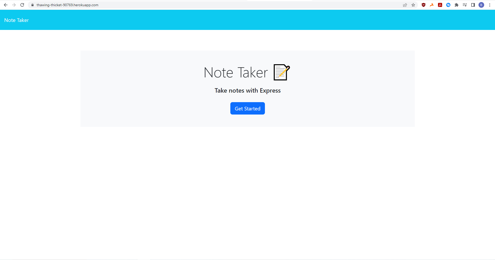
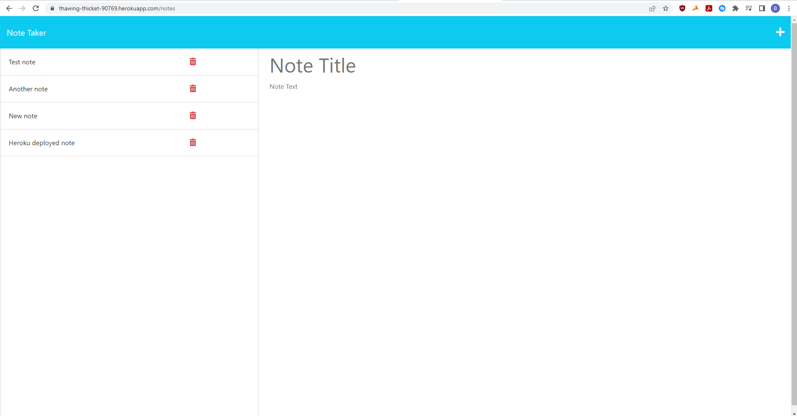

# Note Taker App

## Description
A simple note taker app that utilizes a back-end server to transfer data between a client and server to keep track of notes. This project continues to build up on NodeJS and introduces Express, a piece of server-side tech that's used to establish routes between a client and server. These routes can be used to retrieve, manipulate, or remove certain pieces of data from a database on the server. In this case, it's used to retrieve, add, or delete any stored notes on the server.

## Installation
All necessary packages are included in the package.json and can be installed using the 'npm i' or 'npm install' commands.

## Usage
A local server can be initalized using the 'npm start' command and going to 'localhost:3001'. You will be taken to a landing page with 'Get Started' button in the center. Clicking the button will take you to the actual note taker page. A note must have a title and body text before it can be saved using the appearing save button in the upper right corner. Saved notes will appear in the left column and clicking them will allow you to view the contents of the note. Clicking the 'trash can' button will delete the corresponding note. To empty the text fields for a new note, use the '+' button in the upper right corner.

This app is deployed on heroku and can be reached [here](https://thawing-thicket-90769.herokuapp.com/).

## Credits
N/A

## License
N/A